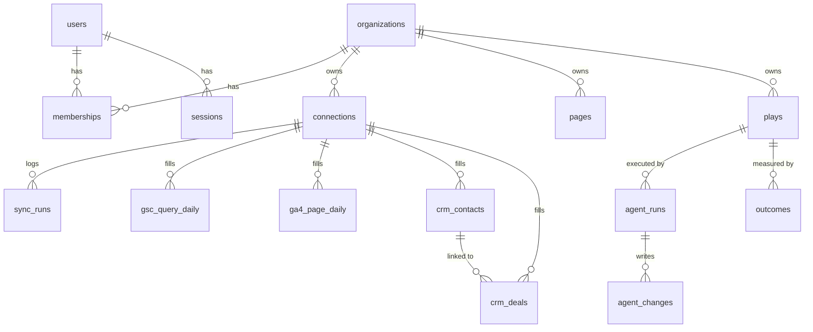

# Data model

All tables live in one PostgreSQL database. The schema is defined in [`backend/src/db/schema.js`](../backend/src/db/schema.js) and migrations are generated into `backend/drizzle/`.

**Status:** tables marked **built** exist today (migration `0000_init`). Tables marked **planned** get added in the roadmap phase shown.

## Relationships

Every table except `users` and `sessions` carries `organization_id`, so one customer can never read another's data.

## Accounts — built

| Table | Key columns | Notes |
|---|---|---|
| `organizations` | `id`, `name`, `slug` (unique) | One per customer company |
| `users` | `id`, `email` (unique), `name`, `avatar_url` | A person; can belong to several orgs |
| `memberships` | `organization_id` + `user_id` (PK), `role` | `owner` / `admin` / `member` |
| `sessions` | `id` (SHA-256 of the cookie token), `user_id`, `expires_at` | Logout = delete the row |

## Connections — built

| Table | Key columns | Notes |
|---|---|---|
| `connections` | `organization_id`, `provider`, `external_account_id`, `scopes[]`, `access_token_enc`, `refresh_token_enc`, `status`, `last_synced_at` | Unique on (org, provider, account). Tokens are encrypted before insert |
| `sync_runs` | `connection_id`, `kind`, `status`, `rows_written`, `error`, `started_at`, `finished_at` | One row per sync attempt; powers the "last synced" UI and debugging |

## Source data — planned (phases 2–3)

Raw facts from each provider, stored at the grain the provider gives us. Primary keys are the natural keys, so re-syncing a day **upserts** instead of duplicating.

| Table | Grain / primary key | Main columns |
|---|---|---|
| `gsc_query_daily` | org, site, date, page_url, query | clicks, impressions, ctr, position |
| `ga4_page_daily` | org, property, date, landing_page, source, medium | sessions, engaged_sessions, conversions |
| `crm_companies` | org, provider, external_id | name, domain |
| `crm_contacts` | org, provider, external_id | email, company_id, first_page_url, created_at_source |
| `crm_deals` | org, provider, external_id | contact_id, amount, currency, stage, is_won, closed_at |
| `pages` | org, url | title, first_seen, last_modified |

`page_url`, `landing_page` and `first_page_url` are all stored **normalized** (lowercase host, no query or fragment, no trailing slash). That shared value is what joins search, traffic and revenue — see [system-design.md §4.2](system-design.md#42-the-sync--score-loop).

## Plays and agents — planned (phases 4–5)

| Table | Key columns | Notes |
|---|---|---|
| `plays` | `kind`, `title`, `value_monthly`, `confidence`, `effort`, `status`, `evidence` (jsonb) | `status`: proposed → approved → running → done / dismissed |
| `agent_runs` | `play_id`, `agent`, `status`, `started_at`, `finished_at` | One execution of an approved play |
| `agent_changes` | `agent_run_id`, `target`, `before` (jsonb), `after` (jsonb), `reverted_at` | Every external write, so it can be rolled back |
| `outcomes` | `play_id`, `metric`, `baseline`, `current`, `measured_at` | Filled 3–6 weeks after a play ships; feeds scoring accuracy |

## Leads — planned (phase 1)

| Table | Key columns | Notes |
|---|---|---|
| `leads` | `email`, `name`, `company`, `source`, `booked_for`, `payload` (jsonb) | Written by the Cal.com webhook |

## Conventions

- Primary keys: `uuid` with `defaultRandom()`, except natural-key fact tables.
- Timestamps: `timestamptz`, named `*_at`, `created_at` on every table.
- Money: `numeric(14,2)` plus a `currency` column. Never floats.
- Enums: Postgres enums for small fixed sets (`provider`, `status`); plain `text` when the set will grow.
- Deletes: `on delete cascade` from `organizations` and `connections`, so disconnecting a source removes its data.
