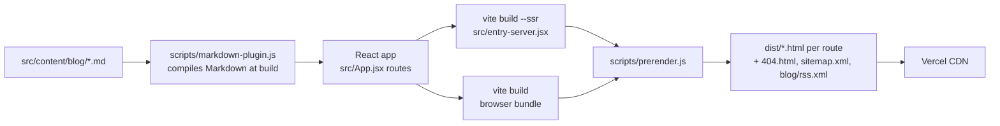

# Frontend

The marketing site at **www.gtmind.in**, in [`frontend/`](../frontend). React 19, Vite, Tailwind CSS 4 and React Router 7, prerendered to static HTML at build time.

## Run it locally

```bash
cd frontend
npm install
npm run dev        # http://localhost:5173
npm run build      # client build + server build + prerender into dist/
npm run preview    # serve dist/ locally
npm run lint
npm run covers     # regenerate blog cover images
```

## How a page is built



1. `vite build` produces the browser JavaScript and CSS.
2. `vite build --ssr` builds a Node version of the same app from `src/entry-server.jsx`.
3. `scripts/prerender.js` renders **every route to real HTML**, with that page's `<title>`, meta tags and structured data from `src/seo/`. It also writes `404.html`, `sitemap.xml` and the blog RSS feed.
4. In the browser, `src/main.jsx` **hydrates** that HTML: the page is readable before JavaScript loads, then becomes interactive.

**Why prerender?** Search engines and AI crawlers that don't run JavaScript still see full content and correct tags on every page. For a site that sells SEO and AI-search visibility, that is non-negotiable.

## Folder structure

```text
frontend/
├── index.html                page template (<!--app-head--> is filled per route)
├── vercel.json               cleanUrls + no trailing slash
├── public/                   copied as-is: blog covers, logo, OG image, robots.txt
├── scripts/
│   ├── markdown-plugin.js    Vite plugin: .md → JS module at build time
│   ├── prerender.js          writes the static HTML
│   ├── covers.js             generates blog cover PNGs
│   └── fonts/                fonts used by covers.js only
└── src/
    ├── main.jsx              browser entry (hydrate or render)
    ├── entry-server.jsx      build-time entry for prerendering
    ├── App.jsx               routes
    ├── index.css             Tailwind + design tokens (@theme) + blog prose styles
    ├── config/site.js        name, domain, email, Cal.com link
    ├── data/                 page content: home, blog index, legal
    ├── content/blog/         articles in Markdown
    ├── seo/                  per-route meta, head tags, route list
    ├── pages/                Home, Blog, BlogPost, Legal, NotFound
    ├── components/
    │   ├── ui/               Button, Container, Reveal, typography…
    │   ├── layout/           Navbar, Footer, Layout
    │   ├── home/             homepage sections
    │   └── blog/             blog cards, meta, calculator
    ├── hooks/useInView.js
    └── assets/               SVGs bundled by Vite
```

## Routes

| Path | Page | Source |
|---|---|---|
| `/` | Home | `pages/Home.jsx` |
| `/blog` | Blog index | `pages/Blog.jsx` |
| `/blog/:slug` | Article | `pages/BlogPost.jsx` + `content/blog/<slug>.md` |
| `/privacy`, `/terms`, `/data-handling`, `/cookies` | Legal | `pages/Legal.jsx` + `data/legal.js` |
| anything else | 404 | `pages/NotFound.jsx` |

New blog posts and legal pages are picked up automatically. A **new kind of page** needs adding in `App.jsx` **and** in `allRoutes()` / `getMeta()` in `src/seo/meta.js`, so it gets prerendered, gets its own meta tags and appears in the sitemap.

## Styling

- Tailwind utility classes, written phone-first: base classes are the phone layout, then `sm:` `md:` `lg:` `xl:` layer on top.
- Design tokens (colours, fonts, shadows, easing, animations) live in the `@theme` block in `src/index.css`, so classes like `bg-primary` and `text-ink-muted` stay consistent everywhere.
- Shared text styles are in `src/components/ui/typography.js`.

## Deploying on Vercel

| Setting | Value |
|---|---|
| Root Directory | `frontend` |
| Framework preset | Vite |
| Build command | `npm run build` |
| Output directory | `dist` |

`vercel.json` sets `cleanUrls: true`, so `/privacy` is served from `privacy.html` and `/blog/seo-roi` from `blog/seo-roi.html`. Unknown URLs get `404.html` with a real **404 status**.

**There is intentionally no catch-all rewrite to `index.html`.** Every route already exists as a file, so deep links and refreshes work. A rewrite would send unknown URLs to the homepage with a 200 status, which search engines treat as "soft 404s".

## Talking to the backend

The marketing site needs no API today — bookings go straight to Cal.com. When a page does need data (e.g. a waitlist form), call `https://api.gtmind.in/v1/...` with `axios`, and add the site's origin to the backend's `CORS_ORIGINS`.

The logged-in **dashboard** is planned as a separate app at `app.gtmind.in` rather than pages inside this site. That keeps the marketing bundle small and fully prerendered, while the dashboard can be a normal client-side app behind login.
