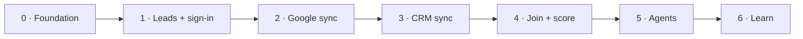

# Roadmap

The order the backend gets built in. Each phase ships something usable on its own.

## Phase 0 — Foundation ✅

- [x] Split the repo into `frontend/` and `backend/`
- [x] Express 5 app with Helmet, CORS allow-list, JSON logging, one error format
- [x] Zod-validated environment variables
- [x] PostgreSQL via Drizzle; first migration with accounts, connections and sync runs
- [x] `/health` and `/health/ready`
- [x] Deploy API + Postgres to Railway, point `api.gtmind.in` at it

## Phase 1 — Leads and sign-in

- [ ] `leads` table + `POST /v1/webhooks/cal` with signature check → every Cal.com booking lands in the database
- [ ] Sign in with Google (OpenID), session cookie, `GET /v1/me`, logout
- [ ] Create an organization on first sign-in; `requireAuth` middleware
- [ ] Rate limiting on auth routes

**Done when:** a booking on the website shows up in `leads`, and a teammate can sign in.

## Phase 2 — Google sync

- [ ] Token encryption helper (`TOKEN_ENCRYPTION_KEY`)
- [ ] Connect Google with `webmasters.readonly` + `analytics.readonly`
- [ ] Worker process with pg-boss; hourly schedule per connection
- [ ] `gsc_query_daily` and `ga4_page_daily` with 16 months of backfill
- [ ] URL normalization helper, shared by every sync
- [ ] Disconnect: revoke at Google, delete synced rows
- [ ] Start Google OAuth app verification (needed before public launch)

**Done when:** connecting Google fills the tables overnight and they stay fresh hourly.

## Phase 3 — CRM sync

- [ ] HubSpot OAuth (read-only CRM scopes)
- [ ] `crm_companies`, `crm_contacts` (with first page seen), `crm_deals`
- [ ] Salesforce after HubSpot, same module interface

**Done when:** closed-won deals are in the database with the page each one started on.

## Phase 4 — Join and score

- [ ] Views joining queries → pages → deals by normalized URL
- [ ] First play types: decaying page, content gap, competitor comparison page
- [ ] Rules-based scoring (value, confidence, effort) from the org's own win rate and deal size
- [ ] `GET /v1/plays` for the dashboard
- [ ] Start the dashboard app at `app.gtmind.in`

**Done when:** a connected customer sees a ranked list of plays with a dollar figure on each.

## Phase 5 — Agents

- [ ] Approve / dismiss plays
- [ ] First agent: page refresh brief → draft, published only after approval
- [ ] Every write logged in `agent_changes`; one-click revert
- [ ] Write scopes requested per agent, only when switched on

## Phase 6 — Learn

- [ ] `outcome:check` jobs at 3 and 6 weeks
- [ ] Score accuracy per org, shown honestly in the dashboard
- [ ] Feed outcomes back into scoring
