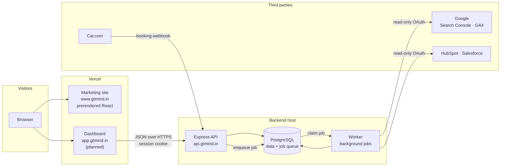
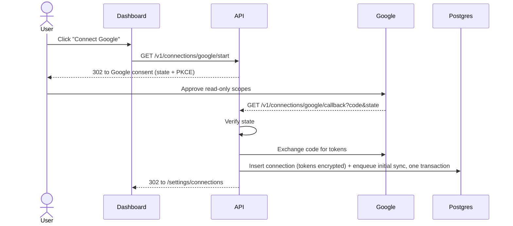
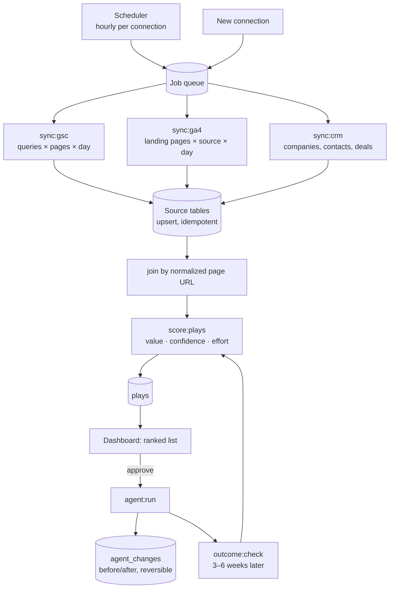

# System design

How gtmind is put together, and why each piece was chosen.

## 1. What the system has to do

gtmind promises one thing on its homepage: **read every GTM source together, work out which plays are worth money, do the approved work, and check whether the number moved.** That is the loop the whole backend is built around:

| Step | What happens | Where it runs |
|---|---|---|
| **Read** | Pull Search Console, GA4 and CRM data on a schedule | Worker (sync jobs) |
| **Decide** | Join the sources, score each opportunity in revenue | Worker (scoring jobs) |
| **Act** | Run only the plays a human approved | Worker (agent jobs), triggered from the API |
| **Learn** | Measure the result weeks later, feed it back into scoring | Worker (outcome jobs) |

Everything a person clicks goes through the **API**. Everything slow or scheduled goes through the **worker**. Both share one **Postgres** database.

## 2. Architecture



### The pieces

| Piece | Tech | Responsibility |
|---|---|---|
| Marketing site | React 19, Vite, Tailwind, prerendered | Public pages, blog, SEO. No backend calls needed. See [frontend.md](frontend.md). |
| Dashboard *(planned)* | React SPA | Logged-in product: connections, plays, approvals, results |
| API | Node + Express 5 | Auth, OAuth connect flows, reading data for the dashboard, approving plays, webhooks |
| Worker *(planned)* | Node + pg-boss | Syncs, scoring, agent runs, outcome checks — anything slow or scheduled |
| Database | PostgreSQL | Source of truth for accounts, synced data, plays **and** the job queue |

The API and worker are **the same codebase** with two entry points (`src/server.js`, `src/worker.js`). They share the schema, the database client and the integration code, but scale and crash independently — a 10-minute GA4 backfill can never make a dashboard request time out.

## 3. Why these choices

### Express (API framework)
- Same language as the frontend, so one person can work across the whole stack.
- Express 5 handles `async` errors natively, which removes the old need for wrapper helpers.
- It is the most documented Node framework; every OAuth provider and library has Express examples.
- Considered **Fastify / Hono**: faster on benchmarks, but our bottleneck is third-party APIs, not request overhead. Not worth the smaller ecosystem.

### PostgreSQL (database)
The product's value is **joining** sources: *search query → page → session → deal → revenue*. That is relational data, queried with joins and aggregations over time.
- One SQL query can answer "which pages started deals that closed last quarter, and what queries feed those pages".
- `jsonb` columns hold raw API payloads and play evidence, so we keep MongoDB-style flexibility where we need it.
- Unique constraints make syncs **idempotent**: re-running a day's sync upserts rows instead of duplicating them.
- Considered **MongoDB**: joins across collections (`$lookup`) are slow and awkward, and our data from Google and CRMs has a fixed, known shape — schemaless storage buys us nothing.

### Drizzle ORM
- Queries read like SQL, which matters for the analytics-heavy parts.
- No generated binary engine or codegen step (unlike Prisma) — keeps the backend light.
- `drizzle-kit` generates plain SQL migration files we commit and review.

### pg-boss for jobs (instead of BullMQ + Redis)
- The job queue lives **inside Postgres**. One fewer service to host, pay for, back up and monitor.
- Supports retries, backoff, cron schedules and singleton jobs — everything the sync loop needs.
- Enqueue a job in the **same transaction** as the row that caused it (e.g. a new connection) — no "saved the row but lost the job" bugs.
- Revisit Redis only if we reach thousands of jobs per second. We won't for a long time.

### Cookie sessions (instead of JWTs)
- The session token sits in an `httpOnly`, `Secure`, `SameSite=Lax` cookie scoped to `.gtmind.in`. JavaScript can't read it, so an XSS bug can't steal it.
- Sessions are rows in Postgres, so logging out or removing a user takes effect immediately. JWTs can't be revoked before they expire.
- `app.gtmind.in` and `api.gtmind.in` are the same *site*, so the cookie is sent without third-party-cookie problems.
- We store a **SHA-256 hash** of the token, so a database leak doesn't leak live sessions.

### JavaScript (ESM), with Zod at the edges
- Matches the frontend. Zod validates everything entering the system — env vars, request bodies, third-party responses — which is where type errors actually come from.
- Moving to TypeScript later is a file-by-file change, not a rewrite.

## 4. Key flows

### 4.1 Connecting Google (Search Console + GA4)



- Scopes are **read-only**: `webmasters.readonly`, `analytics.readonly`. This is the "read-only by default" promise on the website, enforced by Google itself.
- Tokens are encrypted with AES-256-GCM (`TOKEN_ENCRYPTION_KEY`) before they touch the database.

### 4.2 The sync → score loop



**The join key is the page URL.** Google data is aggregated (no individual users), so we can't follow one visitor from search to deal. Instead:

1. The CRM records each contact's **first page seen** (HubSpot `hs_analytics_first_url`, Salesforce via a lead field).
2. Every URL is **normalized** (lowercase host, no query string or fragment, no trailing slash) before storage.
3. Deals → contacts → first page ← GA4 traffic ← Search Console queries. Revenue flows back to the pages and queries that started it.

**Scoring v1 is rules, not ML.** For example, for a "refresh a decaying page" play:

```
value/month ≈ lost clicks × site conversion rate × win rate × average deal size
confidence   = how much history backs each of those numbers
effort       = fixed per play type (low / medium / high)
```

All inputs come from the customer's own closed-won deals — the "scored on your wins, not a benchmark" promise. ML can replace the formulas later without changing the tables.

### 4.3 Cal.com bookings

Cal.com calls `POST /v1/webhooks/cal` when someone books. The API verifies the signature (`CAL_WEBHOOK_SECRET`) and stores a row in `leads`. This is the first real production feature and needs no OAuth.

## 5. Security and data handling

| Concern | Approach |
|---|---|
| Tenant isolation | Every data table has `organization_id`; every query goes through helpers that require it |
| OAuth tokens | AES-256-GCM encrypted at rest; key only in the host's env vars |
| Scopes | Read-only by default; write scopes requested per agent, only when switched on |
| Reversibility | Agents never delete. Each write is logged in `agent_changes` with before/after so it can be rolled back |
| Disconnect | Revokes the token at the provider and deletes that connection's synced data |
| Sessions | Hashed tokens, `httpOnly` + `Secure` + `SameSite=Lax` cookies, server-side expiry |
| HTTP | Helmet headers, CORS allow-list (`CORS_ORIGINS`), JSON body limit, rate limiting on auth routes |
| Secrets | Env vars only; `.env` is git-ignored; `.env.example` documents names, never values |

Google treats `analytics.readonly` as a **sensitive scope**. Before public launch the Google OAuth app needs verification (privacy policy URL, homepage, demo video). Until then, up to 100 test users can connect.

## 6. Deployment

| Service | Host | Domain |
|---|---|---|
| Marketing site | Vercel (root directory: `frontend`) | `www.gtmind.in` |
| Dashboard *(planned)* | Vercel | `app.gtmind.in` |
| API | Railway (or Render) | `api.gtmind.in` |
| Worker | Railway, same repo, start command `node src/worker.js` | — |
| PostgreSQL | Railway Postgres (or Neon) | private |

**Why not run the API on Vercel too?** Vercel functions are short-lived and stateless. The worker needs a long-running process for backfills and a steady connection for the queue. Railway runs the API, the worker and Postgres side by side in one project, on one bill.

Migrations run as a deploy step (`npm run db:migrate`) before the new API version starts.

## 7. How it grows

| When | Change |
|---|---|
| Syncs get slow | Run more worker instances; pg-boss hands each job to exactly one worker |
| Source tables reach tens of millions of rows | Partition `*_daily` tables by month |
| Dashboard queries get slow | Nightly rollup tables (per page, per week) filled by the worker |
| Many more integrations | Each provider stays its own module with the same `connect / sync / disconnect` interface |
| Scoring outgrows rules | Swap the scoring module for a model; `plays` table stays the same |

See [data-model.md](data-model.md) for the tables and [roadmap.md](roadmap.md) for the build order.
